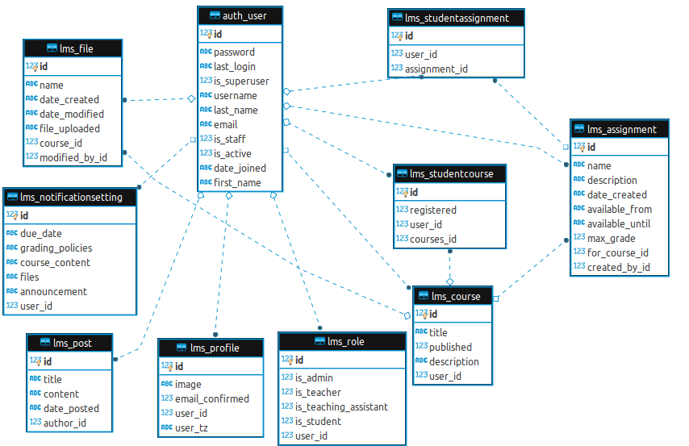

## LMX - EPAi CapStone

Upgraded Replica of Canvas LMS

Group Task

```
The Course Dashboard (logged in) Objectives:
- show list of registered and unregistered courses
- show to-do list (pending assignments and quizzes)
- show coming up schedule
- show student profile
- show a “public” page mode where student can display their work and blog/writeup
- show student settings to change time-zone, notification settings
- And Integrating everything when logged IN
```

---

#### Group Members:

- Aditya Jindal (aditya.jindal4@gmail.com)
- Akshat Jaipuria ()
- Ansalam Daniel (ansimatt@gmail.com)

---

#### Project Setup: 

Follow basic Django project setup as usual except SQLite database migrations part.

Note: [GIT branch]() is already committed with a dummy SQLite database file for use [DataBase File]()

Use command to run: 

```
python3 manage.py runserver
```

---

### Tasks 

- show list of registered and unregistered courses
  - Based on Teacher/Student view the dashboard is populated with published/un-published and registered/un-registered respectively.
  - The View, Publish, UnPublish,  Register buttons on courses are mapped to empty urls as of now.

- show to-do list (pending assignments and quizzes)
  - To-Do view is a part of student session.
  - Dummy assignments are populated based on due date.
- show coming up schedule
  - Coming Up view is a part of teacher session.
  - Dummy assignments of courses belonging to the teacher user are populated based on due date.
- show student profile
  -  Profile URL is attached to the username on the top left corner of the dashboard.
  - Sourced from "@Soma Korada" Profile part and upgraded for Role and Time Zone visibility.
- show a “public” page mode where student can display their work and blog/write up
  - Blogs feature is independent of user session (public view)
  - Using New Post nav bar feature logged in user can create a post.
  - Blogs are on pagination.
- show student settings to change time-zone, notification settings
  - Timezone can be updated in the profile page from the drop down selection. Default Timezone is UTC. (Note: Database should store UTC timestamp for easier conversions)
  - Notification settings are created automatically after user creation and all are set to off by default.

#### Extra feature

- Role objects for user are created automatically after user registration.
- lms_course : Course belonging to a single teacher.
- lms_studentcourse: Students belonging to the course 
- lms_assignment: Assignment belonging to the teacher course.
- lms_studentassignment: Student Assignment is a Assignment object belonging to a student based on student course. Can be upgraded to store student marks.

---

### ERD for the project:



---

Credentials:

ADMIN/Teacher: ansi/hellodude

Teacher: user123/Qwerty@123

Student1: test2/Qwerty@123

Student2: test6/Qwerty@123